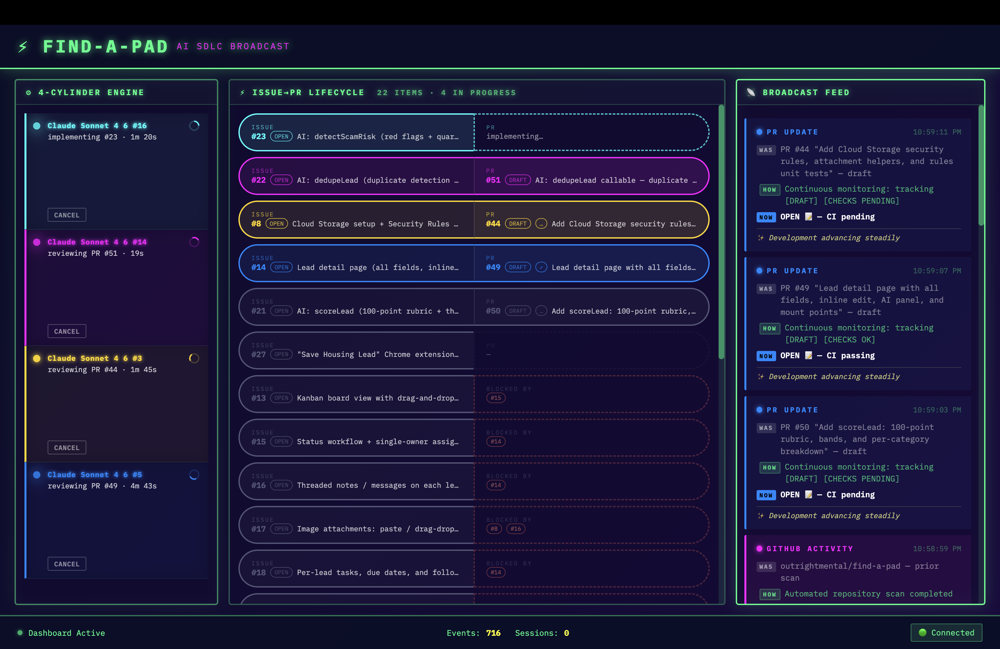
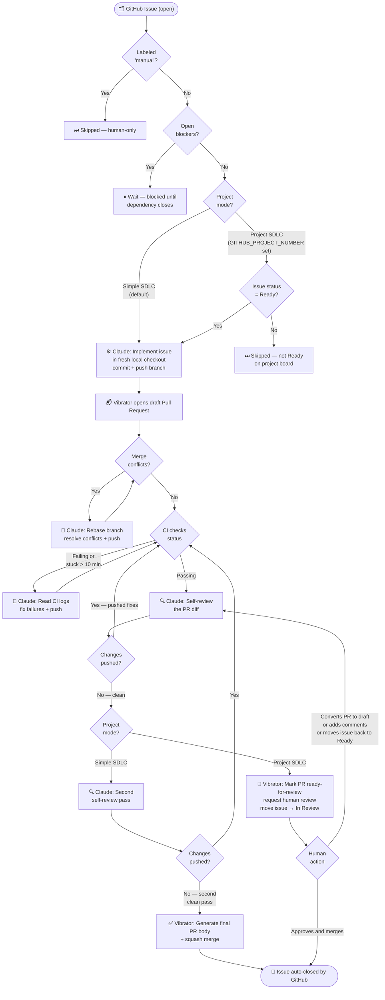

[](https://github.com/outrightmental/vibrator/actions/workflows/test.yml)

# Vibrator

**Turn a GitHub issue queue into a self-driving Claude vibe-coding factory.**

`vibrator` is a TypeScript orchestrator that closes the loop on agentic software development. Write issues. Vibrator handles the rest: it picks up each issue, asks Claude to implement it in a local checkout, opens a draft pull request, self-reviews the diff, fixes anything that needs fixing — review comments, merge conflicts, failing CI — writes a polished final description, and squash-merges. Then it moves on to the next issue.

It is for developers who want the creative part of software development — expressing intent and reviewing outcomes — without babysitting every agent handoff.



## Why this exists

Modern coding agents are powerful, but they still need a conductor — someone to decide what starts next, avoid overloading the repo, notice blocked tasks, run a review pass, route fixes back for another round, preserve closing references, and merge the finished work.

`vibrator` makes that conductor programmable and autonomous, with Claude as the worker behind every step.

Give your repository a prioritized issue backlog and run the loop. The project becomes a living assembly line:

```text
issues → Claude implementation → PR → self-review → fixes → squash merge
```

## For the solo developer

Vibrator is a force multiplier for a solo developer who wants to stay in the creative and strategic flow. You decide what matters — write the issues, set the acceptance criteria, shape the architecture. Vibrator handles the mechanical work:

- **Picks up the next unblocked issue automatically**, so you never lose momentum between tasks.
- **Implements, reviews, and merges in the background** while you focus on design, testing, and product direction.
- **Resolves merge conflicts quietly** — when branches diverge, Vibrator asks Claude to rebase and fix the conflicts before continuing the review cycle, without you ever touching a rebase command.
- **Fixes failing CI without being asked** — it reads the check logs and pushes a fix.
- **Keeps the PR queue clean** — only finished, merged work accumulates; no half-baked draft PRs or stale branches.
- **Respects your control** via the `manual` label — apply it to any issue or PR you want to keep under your direct hand.

The result: you stay in your highest-value role while Vibrator pulls weight in the background to maintain the project's forward momentum.

## SDLC decision tree

The diagram below shows the full lifecycle of an issue through Vibrator, covering both **Simple SDLC** (fully automated, the default) and **Project SDLC** (human-in-the-loop via a GitHub Projects board).



## Simple SDLC

In Simple SDLC mode — the default when `GITHUB_PROJECT_NUMBER` is not set — Vibrator runs fully autonomously from issue to merged PR:

1. Any open, unblocked, non-`manual` issue is eligible to start.
2. Issues are prioritized bugs-first, then by milestone, then by creation time.
3. Claude implements, the PR opens as a draft, Claude self-reviews twice (CI gates apply after any code-changing pass; two consecutive clean passes trigger the merge), and Vibrator squash-merges — no human action required.
4. Merge conflicts and CI failures are handled quietly in the background.

This mode is ideal for personal projects, greenfield work, and any context where CI and branch protections serve as the safety net.

## Project SDLC (Human-in-the-Loop)

Enable Project SDLC by setting `GITHUB_PROJECT_NUMBER` to a GitHub Projects v2 board number. This mode adds a human review gate before any merge:

1. Only issues in **Ready** status on the project board are picked up.
2. When work starts on a Ready issue, it moves to **In Progress**.
3. After one clean self-review, Vibrator marks the PR ready-for-review, requests human review, and moves the issue to **In Review** — it never auto-merges.
4. Vibrator resumes work automatically if:
   - A human converts the PR back to a draft (wants more changes).
   - A new review comment arrives on the PR.
   - The issue is moved back to **Ready** on the project board.

Set `VIBRATOR_REVIEWERS` to a comma-separated list of GitHub logins to notify when a PR is ready.

This mode suits teams where a human QA or architect approves each merge, while Vibrator handles the full implementation-review-fix loop.

## What it does

On every iteration, `vibrator`:

1. Loads open GitHub issues, open pull requests, pending workflow approvals, and local agent-session state.
2. Builds a dependency-aware work plan from issue age plus relationships like `blocked by #123`, `depends on #123`, and `blocks #123`.
3. Enforces a configurable concurrency limit so the repo does not get flooded with half-finished work.
4. For each eligible issue, runs Claude locally in a fresh checkout to implement the change and open a draft pull request.
5. Checks CI status on every open PR — waits for passing checks before advancing, fixes failing checks, and escalates checks stuck for more than 10 minutes.
6. Detects merge conflicts and asks Claude to resolve them before continuing.
7. Asks Claude to self-review the diff and push fixes if needed. Requires two consecutive clean self-reviews before advancing.
8. Generates a polished final PR description with Claude, updates the PR body, preserves closing references, and squash-merges. Retries with `--admin` if GitHub's branch policy requires it.

## The big idea

`vibrator` treats GitHub as the source of truth and Claude as the worker behind every action:

- **Issues are intent.** Write clear issues and dependencies; the loop decides when they are safe to start.
- **Pull requests are work cells.** Each PR moves through review, fix, re-review, and merge phases automatically.
- **Local session state is memory.** A small persisted session store prevents duplicate work and lets each loop cycle pick up where the last one stopped.
- **Humans stay in control.** You own the backlog, repository settings, branch protections, CI, and review standards.

See the deeper docs:

- [Design overview](design/SPEC.md)
- [Agent loop and PR lifecycle](design/AGENT_LOOP.md)

## Quick start

Install dependencies:

```bash
npm install
```

Configure GitHub and Claude authentication (once, if not already done):

```bash
export VIBRATOR_GITHUB_TOKEN=github_pat_...
claude login
```

Optionally copy the environment template to set a default repository:

```bash
cp .env.example .env
# edit .env and set GITHUB_REPOSITORY=owner/repo
```

Run a safe one-shot preview:

```bash
npm run build
npm start -- owner/repo --dry-run --once
```

Run the real loop:

```bash
npm start -- owner/repo
```

The repository slug can be omitted from the CLI when `GITHUB_REPOSITORY` is set.

## Dashboard

`vibrator` opens a real-time **Dashboard** in your browser at `http://localhost:3000` when the loop starts. The Dashboard shows:

- **Issue → PR Lifecycle panel**: a row of two-halved pills, one per open issue. The left half shows the issue; the right half shows the linked pull request and transitions through states:
  - *(absent)* — no PR yet
  - *dotted outline* — implementation is planned for this iteration
  - *solid outline, draft* — PR is open as a draft
  - *solid outline, ready* — PR is open and ready for review
  - *completed (full fill)* — PR is merged/closed

  Each pill is colour-coded to a stable slot in the six-colour palette, matching the worker thread assigned to that issue+PR pair.

- **Implementation / Review / Broadcast Feed** panels showing live orchestrator logs and GitHub activity.

To prevent the Dashboard from opening automatically, pass `--no-browser`:

```bash
npm start -- owner/repo --no-browser
```

The Dashboard server still starts; the URL is printed to stdout so you can open it manually.

**Graceful shutdown**: Press **Escape** while the loop is running to let Vibrator finish any in-flight actions before exiting. Press **Ctrl+C** to exit immediately.

## Requirements

- Node.js 18+
- `git` on `PATH`.
- A GitHub PAT exposed as `VIBRATOR_GITHUB_TOKEN` or `GITHUB_TOKEN`.
- The `claude` CLI (Claude Code) installed locally, on `PATH`, and logged in via `claude login`. Uses your Claude Code subscription — no API key required.

## Configuration

Vibrator uses a GitHub PAT directly for API calls and Git clone/fetch/push operations. Claude Code authentication is still handled by the `claude` CLI.

**GitHub token permissions**

Fine-grained PATs need access to the target repository with:

- Metadata: read
- Contents: read/write
- Pull requests: read/write
- Issues: read/write
- Actions: read/write
- Checks: read
- Commit statuses: read
- Projects: read/write, if using project mode
- Workflows: write, if the agent may push workflow file changes

Classic PATs may need `repo`, `project` when using project mode, and `workflow` when the agent may edit or push workflow files.

**Environment variables**

| Variable | Default | Purpose |
| --- | --- | --- |
| `VIBRATOR_GITHUB_TOKEN` | — | Preferred GitHub PAT used by Vibrator for API and Git operations. |
| `GITHUB_TOKEN` | — | Fallback GitHub token / PAT used when `VIBRATOR_GITHUB_TOKEN` is unset. |
| `GH_TOKEN` | — | Compatibility fallback only. |
| `GITHUB_REPOSITORY` | — | Default `owner/repo` when the CLI argument is omitted. |
| `MAX_CONCURRENCY` | `3` | Maximum active work items across open PRs and in-flight implementations. |
| `CYCLE_MINIMUM_SECONDS` | `60` | Minimum seconds between engine cycle starts. |
| `CLAUDE_MODEL` | *(Claude default)* | Claude model for implementation and review (e.g. `claude-sonnet-4-6`). |
| `CLAUDE_COMMIT_MODEL` | `claude-haiku-4-5-20251001` | Model for commit message generation. A faster model is appropriate here. |
| `DASHBOARD_PORT` | `3000` | HTTP port for the Dashboard server. |
| `DASHBOARD_TITLE` | `Vibrator` | Title displayed in the Dashboard header. |
| `VIBRATOR_SESSION_STORE_PATH` | `<cwd>/.vibrator/<owner>-<repo>-sessions.json` | Path for persisted local agent-session state. |
| `CLAUDE_CREDENTIAL_STORE_DIR` | `~/.vibrator/credentials/claude` | Directory containing stored Claude credentials used for [Multi-account rotation](#multi-account-rotation). |
| `CLAUDE_CREDENTIAL_ROTATION_STORE_PATH` | `~/.vibrator/claude-credential-rotation.json` | Path for persisted credential rotation / rate-limit state. |
| `GITHUB_PROJECT_NUMBER` | — | GitHub Projects v2 board number. Enables [Project SDLC](#project-sdlc-human-in-the-loop). |
| `VIBRATOR_REVIEWERS` | — | Comma-separated GitHub logins to request review from (Project SDLC only). |

**CLI flags**

| Flag | Purpose |
| --- | --- |
| `--once` | Run a single iteration, then exit. |
| `--dry-run` | Print the plan without executing any Claude or GitHub actions. |
| `--no-browser` | Start the Dashboard server but do not auto-open a browser window. |

## Issue language the loop understands

Use normal GitHub issues, plus lightweight relationship phrases in the issue body:

```markdown
blocked by #12
depends on #12
blocks #34
```

`vibrator` will not start an issue while any referenced blocker remains open. Older eligible issues start first (bugs first, then milestone order, then creation time), up to `MAX_CONCURRENCY`.

### The `manual` label

Apply the `manual` label to any issue or PR to remove it from automated work:

- **Issues** labeled `manual` are never picked up by Vibrator.
- **PRs** labeled `manual` receive no automated actions (no self-review, no conflict resolution, no auto-merge) and do not count against `MAX_CONCURRENCY`.

Vibrator creates the `manual` label in the repository on startup if it does not already exist.

### Milestone ordering

Milestones act as a priority queue, not a gate. Issues in earlier milestones are preferred over later-milestone issues, but all eligible unblocked issues can start regardless of milestone. Bug-typed issues (GitHub's native Issue Type = "Bug") always jump ahead of every other type.

Priority order: **Bug** > earlier milestone > later milestone > no milestone, then by creation time within each tier.

### Parent and sub-issues

GitHub sub-issues are understood natively. A parent issue is automatically blocked until all of its open sub-issues are resolved — no explicit dependency phrases needed.

## Multi-account rotation

Vibrator rotates through Claude CLI credentials stored in `~/.vibrator/credentials/claude/`:

```bash
npm run add-claude-credential
npm run list-claude-credentials
npm run remove-claude-credential -- "user@domain.com"
npm run activate-claude-credential -- "user@domain.com"
```

At runtime, Vibrator starts with the first stored credential. When a credential hits Claude rate limits, Vibrator immediately switches to the next credential, broadcasts the rotation loudly in CLI/dashboard, and continues automatically. If all credentials are rate-limited, Vibrator waits until the earliest one is available again.

- `add-claude-credential` runs a Claude login flow, then records account metadata from `claude auth status --text` and captures the active credential.
  - macOS: reads `Claude Code-credentials` from Keychain using `security`.
  - Other platforms: reads `<CLAUDE_HOME or ~/.claude>/.credentials.json`.
- `list-claude-credentials` enumerates JSON files in `~/.vibrator/credentials/claude/`.
- `remove-claude-credential` deletes the matching JSON file.
- `activate-claude-credential` loads one stored credential and writes it back to the active Claude location for the current platform.

Optional configuration:

```bash
CLAUDE_CREDENTIAL_STORE_DIR=/path/to/credentials/claude
CLAUDE_CREDENTIAL_ROTATION_STORE_PATH=/path/to/claude-credential-rotation.json
```

## Development

```bash
npm test
npm run build
```

## Status

This project is intentionally small and sharp: a local orchestrator, a GitHub client, a session store, a Claude agent client, and a planning engine. It is early infrastructure for people who want to run software projects as agentic systems instead of manually copying prompts between tabs.
